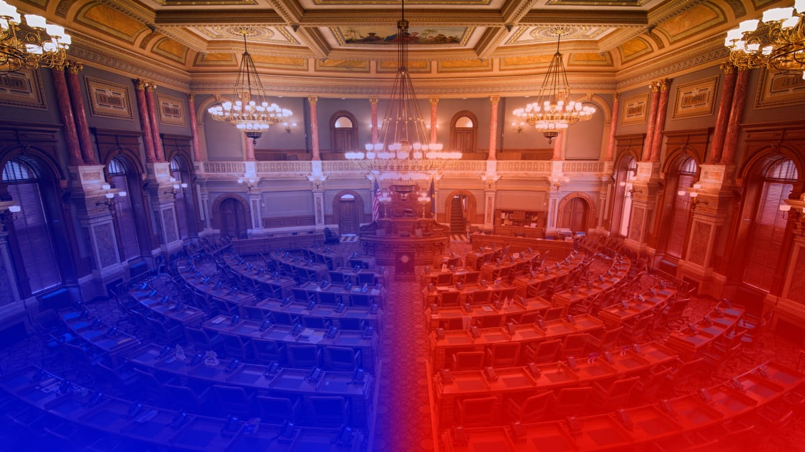

## The American Political Landscape : Polarization between the Left and Right-wing


<em>"<strong>This</strong> is an example sentence."</em> -<strong>OP</strong> c du html 

ok ok 

## Abstract

Political polarization, as defined in Wikipedia, is the extent to which opinions on an issue are opposed. It is assumed that polarization in the world in general, and in the US in particular, has been increasing over the past years. But, is it really the case? Has the polarization been always increasing over past years? In this project, we suggest a data-driven approach to quantify the polarization, and observe how it evolves over time. We explore the possibility of defining a similarity measure between politicians based on their quotes. Once we do this, we would like to study the difference between different political ideologies (mainly left and right) in order to see if there is a significant difference in their quotes.

oki



## Does this quote dataset show the differences and contrasts between right-wing and left-wing politicians ?
## How to define a similarity between politicians ? Can we derive such a measure of similarity ?
## According to this definition, do speakers with the same positioning show a higher level of similarity?
## Clustering the speakers based on this measure, do these clusters match with the ideological left/right separation ?
## Through time, how the distance between these clusters evolve ? Can we relate this evolution to some major historic events ?
## How does the politicians speech vary depending on the educational degree?

### Analysis throughout the years 

| Default aligned | Left aligned | Center aligned  | Right aligned  |
|-----------------|:-------------|:---------------:|---------------:|
| First body part | Second cell  | Third cell      | fourth cell    |
| Second line     | foo          | **strong**      | baz            |
| Third line      | quux         | baz             | bar            |


<div style="text-align: center"><iframe src="lda_vis_2015.html"></iframe></div>


[R visu 2020](https://github.com/ayarahmoun/ayarahmoun.github.io/blob/main/republican_lda_vis_2020.html) 


## Quarterly Results {.tabset}

### By Product

(tab content)

### By Region

(tab content)

```markdown
Syntax highlighted code block

# Header 1
## Header 2
### Header 3

- Bulleted
- List

This <em>word</em> is italic.

1. Numbered
2. List

**Bold** and _Italic_ and `Code` text

[Republican visu 2020](https://github.com/ayarahmoun/ayarahmoun.github.io/blob/main/republican_lda_vis_2020.html) 

and 
```

For more details see [Basic writing and formatting syntax](https://docs.github.com/en/github/writing-on-github/getting-started-with-writing-and-formatting-on-github/basic-writing-and-formatting-syntax).

### Jekyll Themes

Your Pages site will use the layout and styles from the Jekyll theme you have selected in your [repository settings](https://github.com/ayarahmoun/ayarahmoun.github.io/settings/pages). The name of this theme is saved in the Jekyll `_config.yml` configuration file.

### Support or Contact

Having trouble with Pages? Check out our [documentation](https://docs.github.com/categories/github-pages-basics/) or [contact support](https://support.github.com/contact) and we’ll help you sort it out.
